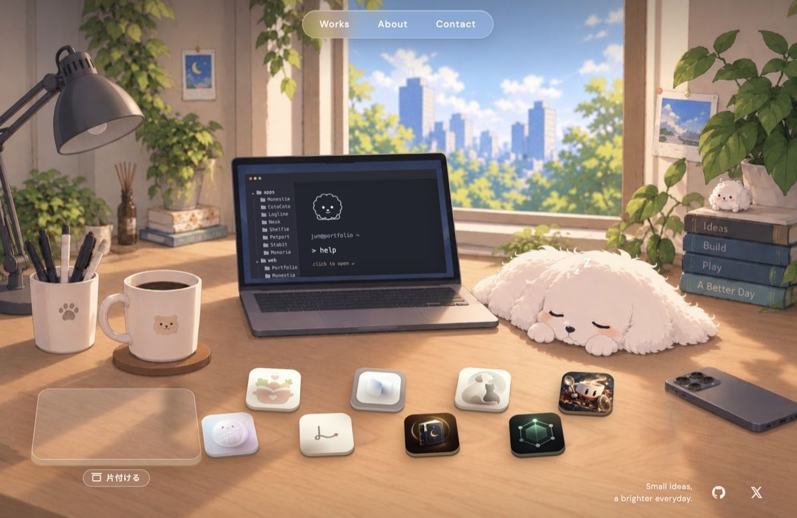

# Jun — Portfolio

**An interactive portfolio set on an illustrated desk.**
Click the laptop for a working terminal, drag the app tiles around, and flip the lamp for night mode.

イラストの机そのものがポートフォリオです。部屋のモノを触ると、作品や自己紹介が開きます。

**▶︎ https://junhayashii0.github.io/Portfolio/**



## 部屋の中

| モノ | 触ると |
|---|---|
| **PC** | カメラが画面に寄って、操作できるターミナルが開く |
| **作品タイル** | クリックで詳細。ドラッグで動かせて、左のケースに1枚ずつしまえる |
| **本** | About（自己紹介・これまで・お手伝いできること） |
| **スマホ** | Contact（X / お問い合わせフォーム） |
| **ランプ** | 昼と夜の切りかえ |
| **犬** | 起きて、操作のヒントを教えてくれる |

ヘッダーの Works / About / Contact からも同じ場所へ行けます。Works では、アプリと Web の作品を一覧で見られます。

### ターミナル

`help` で使えるコマンドの一覧が出ます。コマンドはクリックでも実行でき、Tab 補完と ↑↓ の履歴に対応しています。

```
ls              アプリの一覧（ls web で Web の作品）
open <作品名>    机のタイルが跳ねて、詳細が開く
info <作品名>    紹介をターミナルに表示
about / contact 本 / スマホを開く
lights          部屋の明かりを切りかえる
tidy            タイルを片付ける / ひろげる
whoami / github / pet …
```

### スマホで見ると

- 左右にスワイプして部屋を見回せます
- タイルは指でつまんで動かせます。画面の端まで持って行くと、部屋ごと動きます
- 「傾けて遊ぶ」を押すと、スマホを傾けた方向にタイルが滑ります（iPhone では https のページのみ）

## つくり

フレームワークもビルドもない、素の HTML / CSS / JavaScript です。

- **背景**: 1枚のイラスト（昼と夜の2枚）。PC の画面、クリックできる範囲、タイルが動ける範囲は、すべて背景画像のピクセル座標で合わせています
- **PC の画面**: イラストの画面は少し傾いているので、四隅に合わせて `matrix3d` で貼り付けています
- **タイル**: 自前の簡単な物理演算（摩擦・衝突・傾き）
- **動き**: `prefers-reduced-motion` のときは演出を省きます

```
dist/
  index.html   ページ構成（本・スマホ・ターミナルのダイアログ）
  app.js       作品データ、詳細表示、タイルの物理演算、PC 画面の位置合わせ
  room.js      ターミナル、ケース、昼夜、スマホの見回しと傾き
  styles.css / scene.css / room.css
  assets/      背景、アイコン、スクリーンショット
source-assets/ 背景の元画像と、画像生成に使ったプロンプト
```

## 手元で動かす

```sh
python3 -m http.server 4317 --directory dist
# → http://localhost:4317/
```

`main` に push すると、GitHub Actions が `dist/` を GitHub Pages に公開します（`.github/workflows/pages.yml`）。

## 作品を追加・変更するとき

| 変えたいもの | 場所 |
|---|---|
| アプリの情報 | `app.js` の `projects` |
| App Store のリンク | `app.js` の `appStore`（アプリ ID）。ない作品は「開発中」 |
| スクリーンショット | `assets/shots/<作品>/01.jpg …` と `app.js` の `shotCounts` |
| 紹介サイトなどのリンク | `app.js` の `extraLinks` |
| Web の作品 | `app.js` の `webProjects` |
| お問い合わせフォーム | `room.js` の `FORM_URL` |

背景を差し替えるときは、`app.js` の `screenQuad`（PC 画面の四隅）と `FRONT_EDGE`・`PHONE_LEFT_X`・`HOME`・`CASE_IMG`（タイルの範囲・初期位置・ケース）、`room.css` の `.hotspot-*` を新しい絵に合わせます。

## クレジット

- 背景のイラストは ChatGPT の画像生成で作成し、描き込まれていたタイルなどを消して使っています（プロンプトは `source-assets/`）
- 作品のアイコンとスクリーンショットは、それぞれのアプリのものです

© 2026 Jun Hayashi
